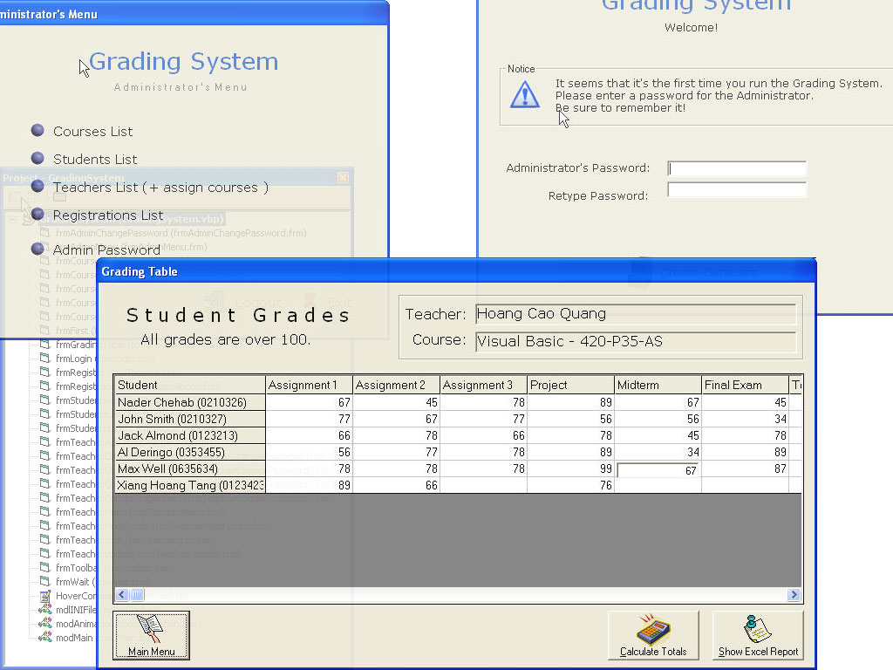



## Grading System

### Description

The Grading System helps maintain and organize a secure and dynamic database in an educational institution. This program was mainly a project for my VB class. I'd like anyone to give their opinions/ideas/advice on this program.
 
### More Info
 
Student information, teacher information, course information, grades etc.

The program includes an option to send a report to Excel. You must have Excel to use this option.

An organized database that you can view/edit through the Grading System program.

the program registers in the win.ini.

However, it has an uninstaller that take

care of unregistering in case you need to.

             |
---                |---
**Submitted On**   |2002-12-10 22:04:18
**By**             |[Nader Chehab](https://github.com/Planet-Source-Code/PSCIndex/blob/master/ByAuthor/nader-chehab.md)
**Level**          |Intermediate
**User Rating**    |5.0 (30 globes from 6 users)
**Compatibility**  |VB 6\.0
**Category**       |[Databases/ Data Access/ DAO/ ADO](https://github.com/Planet-Source-Code/PSCIndex/blob/master/ByCategory/databases-data-access-dao-ado__1-6.md)
**World**          |[Visual Basic](https://github.com/Planet-Source-Code/PSCIndex/blob/master/ByWorld/visual-basic.md)
**Archive File**   |[Grading\_Sy15113412112002\.zip](https://github.com/Planet-Source-Code/nader-chehab-grading-system__1-41448/archive/master.zip)

